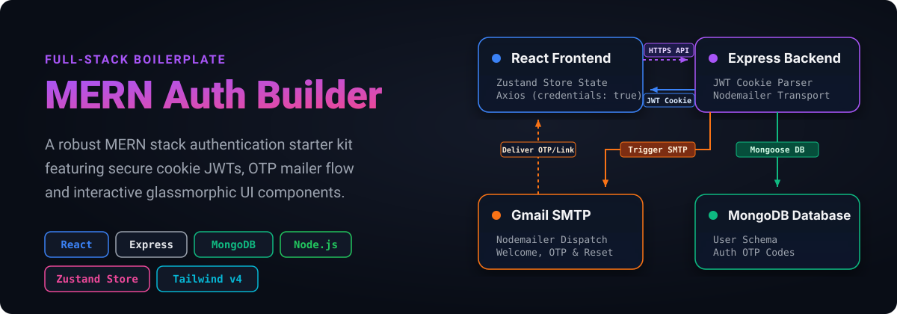

<p align="center">
  
</p>

# MERN Auth Builder

A production-ready, full-stack boilerplate implementing secure authentication workflows. Built with **MongoDB, Express, React, and Node.js (MERN)**, this starter kit includes HTTP-only JWT cookies, email verification (OTP), password recovery flows, and smooth glassmorphic UI components powered by Framer Motion.

---

## ⚡ Core Capabilities

- **🔐 Robust Session Management**: Secure JWT sessions transmitted via `httpOnly`, `sameSite: "strict"`, and `secure` (in production) cookies to block XSS and CSRF attacks.
- **✉️ Automated Email Workflows**: Integrated email delivery using **Nodemailer** and Gmail SMTP for dispatching 6-digit verification codes (OTP) and password reset tokens.
- **🔮 Glassmorphism & Motion UI**: Modern visual layout featuring animated floating shapes, backdrop blur filters, and state-based page transitions built with **Tailwind CSS v4** and **Framer Motion**.
- **🧠 Store State Management**: Centralized client store using **Zustand** for asynchronous authentication logic (signup, login, verification, password resets) and toast notifications.
- **🛡️ Protected Client Routes**: Pre-configured React Router guards that redirect users based on verification status and authentication state.

---

## 🛠️ Architecture & Tech Stack

| Layer | Technologies | Role / Purpose |
|---|---|---|
| **Frontend** | React (v19), Zustand, Vite | Client UI, Global State, Asset Bundling |
| **Styling** | Tailwind CSS (v4), Framer Motion | Glassmorphic aesthetics, fluid page transitions |
| **Backend** | Express.js, Node.js | Router, API endpoints, session verification |
| **Database** | MongoDB, Mongoose | Data modeling, user collections, verification tokens |
| **Mailing** | Nodemailer (Gmail SMTP service) | OTP dispatch and password reset template rendering |

---

## 🚀 Quick Start Guide

### 1. Prerequisites
Ensure you have the following installed on your machine:
- **Node.js** (v18+ recommended)
- **MongoDB** (Local instance or MongoDB Atlas cluster URI)
- A **Gmail account** (with an App Password enabled) for sending automated emails.

### 2. Configuration Setup
Create a `.env` file in the **root** directory and define the following variables:

```env
PORT=5000
MONGO_URI=your_mongodb_connection_string
JWT_SECRET=your_jwt_signing_secret_key
NODE_ENV=development
GMAIL_USER=your_gmail_username@gmail.com
GMAIL_TOKEN=your_gmail_app_password
CLIENT_URL=http://localhost:5173
```

### 3. Installation
Install all dependencies for both the backend and frontend:

```bash
# Install backend & root dependencies
npm install

# Build and install frontend dependencies
npm run build
```

### 4. Running the Application

#### Development Mode
Run the backend with Nodemon hot-reloading and launch the Vite dev server concurrently:

```bash
# Start backend server (runs on Port 5000)
npm run dev

# Start frontend dev client (runs on Port 5173)
cd frontend && npm run dev
```

#### Production Mode
Serve the optimized frontend build assets statically through the Node express server:

```bash
# Run production build and start server
npm start
```

---

## 🔌 API Endpoints Reference

All routes are prefixed with `/api/auth`.

| HTTP Method | Endpoint | Request Body | Cookie Side-effects | Description |
|:---:|---|---|---|---|
| **GET** | `/check-auth` | *None* | Reads `token` cookie | Verifies current JWT token and returns authenticated user metadata. |
| **POST** | `/signup` | `{ name, email, password }` | Sets `token` cookie | Registers a new user account and dispatches verification OTP to email. |
| **POST** | `/login` | `{ email, password }` | Sets `token` cookie | Logs in existing user, updating last login timestamp. |
| **POST** | `/logout` | *None* | Clears `token` cookie | Invalidates the active user session cookie. |
| **POST** | `/verify-email` | `{ code }` | *None* | Validates the 6-digit OTP code to mark user as verified. |
| **POST** | `/forgot-password` | `{ email }` | *None* | Generates password reset token and emails recovery URL. |
| **POST** | `/reset-password/:token`| `{ password }` | *None* | Validates password reset token and saves new hashed password. |

---

## 📂 Project Topology

```text
auth/
├── backend/
│   ├── controllers/      # Route handler logic (auth.controller.js)
│   ├── db/               # MongoDB connection client (connectDB.js)
│   ├── mailtrap/         # Email templates and Nodemailer configuration
│   ├── middleware/       # JWT token verification router guard
│   ├── models/           # Mongoose schemas (user.model.js)
│   ├── routes/           # Endpoint definitions (auth.route.js)
│   ├── utils/            # JWT generators (generateTokenAndSetCookie.js)
│   └── index.js          # App entry point & production build router
├── frontend/
│   ├── src/
│   │   ├── components/   # Floating shapes and load state components
│   │   ├── pages/        # Dashboard, Login, Signup, Reset, Verification views
│   │   ├── store/        # Zustand useAuthStore state engine
│   │   ├── utils/        # Date formatters and helper libraries
│   │   ├── App.jsx       # App shell & router routing paths
│   │   └── main.jsx      # React client entry point
│   ├── vite.config.js    # Bundler config
│   └── index.html        # SPA template
└── package.json          # Root npm manifest scripts
```
